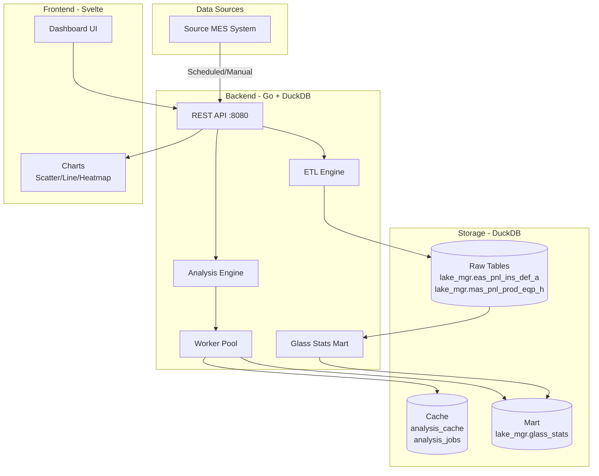

# LGD liteStat - Display Manufacturing Data Analysis System

A comprehensive OLAP system for analyzing display manufacturing process data using Go backend with embedded DuckDB and Svelte frontend.

## 📖 개요 (Overview)

디스플레이 제조 공정에서 발생하는 대량의 검사 및 진행이력 데이터를 분석하여 공정별, 장비별 불량률을 비교 분석하는 시스템입니다.

This system analyzes massive amounts of inspection and process history data from display manufacturing to compare defect rates by process and equipment.

### 주요 기능 (Key Features)

- ✅ **시간 기반/ Glass ID 기반 데이터 조회** - Time-based / Glass ID-based data queries
- ✅ **자동 데이터 수집** - Automated data collection (crontab integration)
- ✅ **고속 데이터 마트** - High-speed data mart with DuckDB columnar engine
- ✅ **Target vs Others 분석** - Compare equipment performance against baseline
- ✅ **4가지 분석 결과** - 4 analysis result sets (glass/lot/daily/heatmap)
- ✅ **비동기 작업 처리** - Async job processing with caching
- ✅ **REST API** - 10 comprehensive REST endpoints
- ✅ **Docker 배포** - Production-ready Docker deployment

---

## 🏗️ 아키텍처 (Architecture)



### 3-Layer Design

1. **Raw Layer** - 원본 데이터 (`lake_mgr` 스키마 내 테이블)
2. **Mart Layer** - 집계 데이터 (`glass_stats`) - 성능 최적화의 핵심
3. **Serving Layer** - 동적 쿼리 (Target vs Others 분류)

---

## 📁 소스 트리 (Source Tree)

```
lgd-liteStat/
├── backend/                      # Go 백엔드
│   ├── api/                      # REST API 핸들러
│   │   ├── handlers.go          # 10개 API 엔드포인트
│   │   └── router.go            # 라우팅 및 미들웨어
│   ├── config/                   # 설정 관리
│   │   └── config.go            # .env + YAML 설정 로딩
│   ├── database/                 # DuckDB 통합
│   │   ├── db.go                # 연결 및 초기화
│   │   ├── repository.go        # 데이터 접근 계층
│   │   └── schema_duckdb.sql    # lake_mgr 스키마 및 테이블 정의
│   ├── etl/                      # ETL 파이프라인
│   │   ├── ingest.go            # 데이터 수집 및 변환
│   │   └── mock.go              # 목 데이터 생성기 (1M+ records)
│   ├── mart/                     # 데이터 마트 빌더
│   │   └── mart.go              # glass_stats 생성 및 갱신
│   ├── analysis/                 # 분석 엔진
│   │   └── analyzer.go          # Target vs Others 분석
│   ├── jobs/                     # 비동기 작업 풀
│   │   └── worker.go            # 워커 풀 관리
│   ├── main.go                   # 애플리케이션 진입점
│   ├── Dockerfile               # 프로덕션 빌드 (멀티 스테이지)
│   ├── go.mod                    # Go 모듈 정의
│   └── go.sum                    # 의존성 체크섬
│
├── frontend/                     # Svelte 프론트엔드 (Node 20+ 필요)
│   ├── src/
│   │   ├── routes/
│   │   │   └── +page.svelte     # 메인 대시보드
│   │   └── lib/
│   │       ├── components/       # UI 컴포넌트
│   │       ├── api.js           # API 클라이언트
│   │       └── export.js        # 내보내기 기능
│   ├── Dockerfile               # 프로덕션 빌드 (Nginx)
│   └── vite.config.js           # Vite 설정
│
├── data/                         # DuckDB 데이터 파일 (볼륨 마운트)
│   └── analytics.duckdb         # 메인 데이터베이스 파일
│
├── .env                          # 환경 변수 (비밀 정보)
├── .env.example                 # 환경 변수 템플릿
├── config.yaml                   # 애플리케이션 설정
├── config.yaml.example          # 설정 파일 템플릿
├── docker-compose.yml           # Docker Compose 설정
├── test_backend.sh              # 백엔드 API 테스트 스크립트
├── README.md                     # 이 문서
└── API.md                        # API 상세 문서
```

---

## 🛠️ 기술 스택 (Tech Stack)

### Backend

- **Language**: Go 1.24+
- **Database**: DuckDB (Embedded OLAP, CGO required)
- **Frameworks**: Gorilla Mux, Viper, godotenv

### Frontend

- **Framework**: Svelte 4+ (Vite)
- **Charts**: Plotly.js (Scatter/Line/Heatmap)
- **Styling**: TailwindCSS + DaisyUI

---

## 📊 데이터 모델 (Data Model)

모든 데이터는 `lake_mgr` 스키마 내에 저장됩니다.

### 테이블 구조 (Tables)

#### 1. lake_mgr.eas_pnl_ins_def_a - 검사 정보 (Inspection)
```sql
CREATE TABLE lake_mgr.eas_pnl_ins_def_a (
    glass_id TEXT,                    -- Glass 식별자
    panel_id TEXT,                    -- Panel 식별자
    product_id TEXT,                  -- 제품 ID
    panel_addr TEXT,                  -- Panel 주소 (예: A1, B2)
    def_pnt_x FLOAT,                  -- 불량 위치 X
    def_pnt_y FLOAT,                  -- 불량 위치 Y
    term_name TEXT,                   -- 불량명
    inspection_end_ymdhms TIMESTAMP,  -- 검사 종료 시간
    process_code TEXT,                -- 공정 코드
    defect_count INTEGER              -- 불량 수
);
```

#### 2. lake_mgr.mas_pnl_prod_eqp_h - 진행 이력 (History)
```sql
CREATE TABLE lake_mgr.mas_pnl_prod_eqp_h (
    glass_id TEXT,                    -- Glass 식별자
    product_id TEXT,
    lot_id TEXT,                      -- Lot ID
    equipment_line_id TEXT,           -- 장비 ID
    process_code TEXT,                -- 공정 코드
    track_out_ymdhms TIMESTAMP,       -- 공정 완료 시간
    seq_num INTEGER                   -- 순번
);
```

#### 3. lake_mgr.glass_stats - 데이터 마트 (Mart)
```sql
CREATE TABLE lake_mgr.glass_stats (
    glass_id TEXT PRIMARY KEY,
    lot_id TEXT,
    product_id TEXT,
    work_date DATE,
    total_defects INTEGER,            -- 요약된 전체 불량 수
    created_at TIMESTAMP
);
```

#### 4. analysis_cache & jobs
- `analysis_cache`: 분석 결과 JSON 캐싱 (Key: Request MD5)
- `analysis_jobs`: 비동기 분석 작업 상태 추적

---

## 📡 API 목록 (API Endpoints)

### 1. Analysis APIs
- `GET /api/equipment/rankings` - 장비별 불량률 순위 (기간, 불량명 필터)
- `POST /api/analyze` - 상세 분석 요청 (비동기)
- `GET /api/analyze/:id/results` - 분석 결과 조회 (Glass/Lot/Daily/Heatmap)

### 2. Data Management
- `POST /api/mart/refresh` - 데이터 마트 수동 갱신

---

## 🚀 Quick Start

### 로컬 개발 (Local Development)

#### 1. 백엔드 실행
```bash
cd backend
go mod download
# -mock 플래그로 목 데이터 생성
go run main.go -mock 
go run main.go
```
서버: `http://localhost:8080`

#### 2. 프론트엔드 실행
```bash
cd frontend
nvm use 20
npm install
npm run dev
```
UI: `http://localhost:5173`

### 프로덕션 배포 (Production Deployment)

```bash
# Docker Compose로 전체 스택 실행
podman-compose up -d --build
```

---

### Data Preprocessing & Ingestion Logic

The system performs specific transformations during data ingestion (Upsert) to prepare for analysis:

1.  **Panel Address Derivation**:
    *   `panel_addr` is derived by removing the `product_id` prefix from the `panel_id`.
    *   Example: `panel_id='G123A1'`, `product_id='G123'` -> `panel_addr='A1'`.
    *   **Coordinates**: `panel_x` is the prefix (e.g., 'A'), and `panel_y` is the suffix (e.g., '1').
    *   Heatmaps are aggregated based on these `panel_x` and `panel_y` text labels.

2.  **Defect Name Extraction**:
    *   derived from `def_latest_summary_defect_term_name_s`.
    *   Format: `TYPE-DEFECT-SIZE-REASON`. Extracted as `DEFECT-REASON` (Parts 2 & 4).

3.  **Ranking Logic (Delta)**:
    *   **Delta** = `Avg(Others) - Overall Avg`.
    *   **Others Avg**: Average defect rate of all other equipment in the same process group.
    *   **Sort**: Ascending by Delta. (Negative Delta indicates the equipment is performing better than the group average, assuming lower defect rate is better).
    *   **Note**: Original requirement was Others - Overall.

4.  **Grouping**:
    *   Analysis is grouped by `equipment_line_id` AND `process_code`.
    *   Duplicate glasses (due to child equipment) are handled via `COUNT(DISTINCT product_id)`.

## API Documentation

---

##  Configuration

### 환경 변수 (.env)
```env
DB_PATH=./data/analytics.duckdb
API_PORT=8080
```

### 목 데이터 (Mock Data)
`main.go -mock` 실행 시 `etl/mock.go`가 `lake_mgr` 테이블에 랜덤 데이터를 생성합니다. 
생성된 데이터는 `duckdb` 파일에 저장되므로, 컨테이너 재시작 시에도 유지됩니다.

---

## 🐛 문제 해결 (Troubleshooting)

### "No Data" in Dashboard
1. `go run main.go -mock`을 실행하여 데이터를 생성했는지 확인하세요.
2. 대시보드의 날짜 범위가 생성된 데이터 범위(기본 2주 전 ~ 오늘)와 일치하는지 확인하세요.
3. 브라우저 콘솔(F12)에서 `/api/equipment/rankings` 호출이 성공하는지 확인하세요.

---

## 🎯 현재 상태 (Current Status)

### ✅ 완료
- Backend: `lake_mgr` 스키마 마이그레이션 완료
- API: 장비 랭킹 및 분석 API 연동 완료
- Frontend: 대시보드 UI 개선, 디버그 모드 제거, 날짜 기본값 변경(2주)
- Database: DuckDB 기반 고성능 쿼리 엔진 적용

### ⚠️ 진행 중
- Heatmap 데이터 정합성 검증 (Mock 데이터 좌표 분포)
