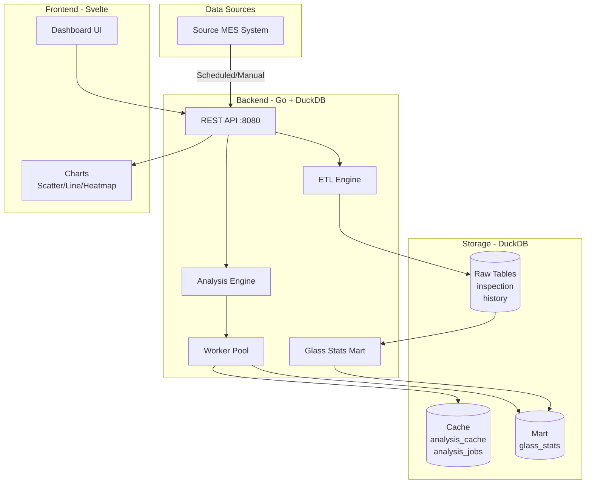

# LGD liteStat - Display Manufacturing Data Analysis System

A comprehensive OLAP system for analyzing display manufacturing process data using Go backend with embedded DuckDB and Svelte frontend.

## 📖 개요 (Overview)

디스플레이 제조 공정에서 발생하는 대량의 검사 및 진행이력 데이터를 분석하여 공정별, 장비별 불량률을 비교 분석하는 시스템입니다.

This system analyzes massive amounts of inspection and process history data from display manufacturing to compare defect rates by process and equipment.

### 주요 기능 (Key Features)

- ✅ **시간 기반/ Glass ID 기반 데이터 조회** - Time-based / Glass ID-based data queries
- ✅ **자동 데이터 수집** - Automated data collection (crontab integration)
- ✅ **고속 데이터 마트** - High-speed data mart with DuckDB columnar engine
- ✅ **Target vs Others 분석** - Compare equipment performance against baseline
- ✅ **4가지 분석 결과** - 4 analysis result sets (glass/lot/daily/heatmap)
- ✅ **비동기 작업 처리** - Async job processing with caching
- ✅ **REST API** - 10 comprehensive REST endpoints
- ✅ **Docker 배포** - Production-ready Docker deployment

---

## 🏗️ 아키텍처 (Architecture)



### 3-Layer Design

1. **Raw Layer** - 원본 데이터 (inspection, history)
2. **Mart Layer** - 집계 데이터 (glass_stats) - 성능 최적화의 핵심
3. **Serving Layer** - 동적 쿼리 (Target vs Others 분류)

---

## 📁 소스 트리 (Source Tree)

```
lgd-liteStat/
├── backend/                      # Go 백엔드
│   ├── api/                      # REST API 핸들러
│   │   ├── handlers.go          # 10개 API 엔드포인트
│   │   └── router.go            # 라우팅 및 미들웨어
│   ├── config/                   # 설정 관리
│   │   └── config.go            # .env + YAML 설정 로딩
│   ├── database/                 # DuckDB 통합
│   │   ├── db.go                # 연결 및 초기화
│   │   ├── repository.go        # 데이터 접근 계층
│   │   └── schema.sql           # 테이블 스키마 (5개 테이블)
│   ├── etl/                      # ETL 파이프라인
│   │   ├── ingest.go            # 데이터 수집 및 변환
│   │   └── mock.go              # 목 데이터 생성기 (1M+ records)
│   ├── mart/                     # 데이터 마트 빌더
│   │   └── mart.go              # glass_stats 생성 및 갱신
│   ├── analysis/                 # 분석 엔진
│   │   └── analyzer.go          # Target vs Others 분석
│   ├── jobs/                     # 비동기 작업 풀
│   │   └── worker.go            # 워커 풀 관리
│   ├── main.go                   # 애플리케이션 진입점
│   ├── Dockerfile               # 프로덕션 빌드 (멀티 스테이지)
│   ├── go.mod                    # Go 모듈 정의
│   └── go.sum                    # 의존성 체크섬
│
├── frontend/                     # Svelte 프론트엔드 (Node 20+ 필요)
│   ├── src/
│   │   ├── routes/
│   │   │   └── +page.svelte     # 메인 대시보드
│   │   └── lib/
│   │       ├── components/       # UI 컴포넌트
│   │       ├── api.js           # API 클라이언트
│   │       └── export.js        # 내보내기 기능
│   ├── Dockerfile               # 프로덕션 빌드 (Nginx)
│   └── vite.config.js           # Vite 설정
│
├── data/                         # DuckDB 데이터 파일 (볼륨 마운트)
│   └── analytics.duckdb         # 메인 데이터베이스 파일
│
├── .env                          # 환경 변수 (비밀 정보)
├── .env.example                 # 환경 변수 템플릿
├── config.yaml                   # 애플리케이션 설정
├── config.yaml.example          # 설정 파일 템플릿
├── docker-compose.yml           # Docker Compose 설정
├── test_backend.sh              # 백엔드 API 테스트 스크립트
├── README.md                     # 이 문서
└── API.md                        # API 상세 문서
```

---

## 🛠️ 기술 스택 (Tech Stack)

### Backend

| Category | Technology | Version | Purpose |
|----------|-----------|---------|---------|
| **Language** | Go | 1.24+ | 고성능 서버, CGO 지원 |
| **Database** | DuckDB | Latest | 임베디드 OLAP 엔진 (CGO) |
| **HTTP Router** | Gorilla Mux | 1.8+ | REST API 라우팅 |
| **Configuration** | Viper | 1.21+ | YAML 설정 관리 |
| **Environment** | godotenv | 1.5+ | .env 파일 로딩 |
| **UUID** | google/uuid | 1.6+ | Job ID 생성 |
| **CORS** | gorilla/handlers | 1.5+ | CORS 미들웨어 |

### Frontend

| Category | Technology | Version | Purpose |
|----------|-----------|---------|---------|
| **Framework** | Svelte | 4+ | 반응형 UI 프레임워크 |
| **Build Tool** | Vite | 7+ | 빌드 및 개발 서버 |
| **Charts** | Plotly.js | Latest | Scatter/Line/Heatmap 차트 |
| **Export** | jsPDF + html2canvas | Latest | PDF/HTML 내보내기 |

### Infrastructure

| Category | Technology | Purpose |
|----------|-----------|---------|
| **Container** | Docker | 애플리케이션 컨테이너화 |
| **Orchestration** | Docker Compose | 멀티 컨테이너 관리 |
| **Web Server** | Nginx (Alpine) | 정적 파일 서빙 + 리버스 프록시 |
| **Scheduler** | Cron | 데이터 수집 자동화 |

### Key Dependencies

**Go Modules:**
```go
require (
    github.com/marcboeker/go-duckdb v1.8.5  // DuckDB driver (CGO)
    github.com/gorilla/mux v1.8.1           // HTTP router
    github.com/spf13/viper v1.21.0          // Configuration
    github.com/joho/godotenv v1.5.1         // Environment variables
    github.com/google/uuid v1.6.0           // UUID generation
    github.com/gorilla/handlers v1.5.2      // CORS middleware
)
```

---

## 📊 데이터 모델 (Data Model)

### 테이블 구조 (Tables)

#### 1. inspection - 검사 정보
```sql
CREATE TABLE inspection (
    glass_id TEXT,                      -- Glass 식별자 (조인 키)
    panel_id TEXT,                      -- Panel 식별자
    product_id TEXT,                    -- 제품 ID
    panel_addr TEXT,                    -- panel_id - product_id
    term_name TEXT,                     -- 원본 불량명 (예: "TYPE1-SPOT-SIZE-DARK")
    defect_name TEXT,                   -- 추출된 불량명 (예: "SPOT-DARK")
    inspection_end_ymdhms TIMESTAMP,
    process_code TEXT,
    defect_count INTEGER
);
```

#### 2. history - 진행 이력
```sql
CREATE TABLE history (
    glass_id TEXT,                      -- Glass 식별자 (조인 키)
    product_id TEXT,
    lot_id TEXT,                        -- 로트 ID (30 glasses/lot)
    equipment_line_id TEXT,             -- 장비 ID
    process_code TEXT,
    timekey_ymdhms TIMESTAMP,
    seq_num INTEGER                     -- 중복 처리용 (높을수록 최신)
);
```

#### 3. glass_stats - 데이터 마트 (핵심)
```sql
CREATE TABLE glass_stats (
    glass_id TEXT PRIMARY KEY,
    lot_id TEXT,
    product_id TEXT,
    work_date DATE,
    total_defects INTEGER,              -- 사전 집계된 불량 수
    created_at TIMESTAMP
);
```

#### 4. analysis_cache - 분석 결과 캐시
```sql
CREATE TABLE analysis_cache (
    cache_key TEXT PRIMARY KEY,         -- 요청 파라미터의 MD5 해시
    request_params JSON,
    glass_results JSON,                 -- Glass별 결과
    lot_results JSON,                   -- Lot별 집계
    daily_results JSON,                 -- 일별 시계열
    heatmap_results JSON,               -- Panel 위치 히트맵
    metrics JSON,                       -- 요약 지표
    created_at TIMESTAMP,
    expires_at TIMESTAMP
);
```

#### 5. analysis_jobs - 비동기 작업 추적
```sql
CREATE TABLE analysis_jobs (
    job_id TEXT PRIMARY KEY,
    status TEXT,                        -- pending|running|completed|failed
    cache_key TEXT,
    error_message TEXT,
    progress INTEGER,
    created_at TIMESTAMP,
    updated_at TIMESTAMP
);
```

### 데이터 변환 로직 (Transformation Logic)

#### defect_name 추출
```
term_name: "TYPE1-SPOT-SIZE-DARK"
         ↓ (요소 2, 4 추출)
defect_name: "SPOT-DARK"
```

#### panel_addr 계산
```
panel_id: "ABCDEFAB1"
product_id: "ABCDEF"
         ↓ (빼기)
panel_addr: "AB1"
```

#### History 중복 제거
```sql
-- 같은 glass+process+equipment 조합에서 마지막 기록만 유지
SELECT DISTINCT ON (glass_id, process_code, equipment_line_id) *
FROM history
ORDER BY glass_id, process_code, equipment_line_id, seq_num DESC
```

---

## 📡 API 목록 (API Endpoints)

총 **10개의 REST API** 제공:

### 1. Health Check
- `GET /health` - 시스템 상태 확인

### 2. Data Query APIs (신규 추가)
- `GET /api/inspection` - **검사 정보 조회** (시간 단위 필수, process_code, defect_name 옵션)
- `GET /api/history` - **진행이력 조회** (glass_id 필수, process_code, equipment_id 옵션)

### 3. Data Management APIs
- `POST /api/ingest` - 데이터 수집 (시간 범위)
- `POST /api/mart/refresh` - 데이터 마트 갱신
- `POST /api/cleanup` - 오래된 데이터 삭제 (1년+)

### 4. Analysis APIs
- `POST /api/analyze` - 분석 요청 (비동기)
- `GET /api/analyze/:id/status` - 분석 상태 확인
- `GET /api/analyze/:id/results` - 분석 결과 조회 (4개 테이블 + 지표)
- `GET /api/equipment/rankings` - 장비별 불량률 순위

**📘 상세 사용법**: [`API.md`](./API.md) 참조

---

## 🚀 Quick Start

### 전제조건 (Prerequisites)

- **Go 1.24+** - CGO 지원을 위한 최신 버전
- **GCC/G++** - DuckDB 컴파일에 필요
- **Docker & Docker Compose** - 컨테이너 배포용
- **Node.js 20+** - 프론트엔드 개발 (현재 미완성)

### 로컬 개발 (Local Development)

#### 백엔드 실행

```bash
cd backend

# 의존성 설치
go mod download

# 빌드
CGO_ENABLED=1 go build -o bin/lgd-litestat main.go

# 실행
./bin/lgd-litestat
```

서버 시작: `http://localhost:8080`

#### API 테스트

```bash
# 전체 API 자동 테스트
chmod +x test_backend.sh
./test_backend.sh

# 또는 개별 테스트
curl http://localhost:8080/health
```

### 프로덕션 배포 (Production Deployment)

```bash
# 모든 서비스 시작
docker-compose up -d

# 로그 확인
docker-compose logs -f backend

# 서비스 중지
docker-compose down
```

---

## ⏰ Crontab 스케줄링 예시

```bash
# crontab 편집
crontab -e

# 아래 추가:

# 매시간 데이터 수집 (정시)
0 * * * * curl -X POST http://localhost:8080/api/ingest -H "Content-Type: application/json" -d '{"start_time":"'$(date -u -d '1 hour ago' +\%Y-\%m-\%dT\%H:00:00Z)'","end_time":"'$(date -u +\%Y-\%m-\%dT\%H:00:00Z)'"}'

# 매시간 마트 갱신 (수집 5분 후)
5 * * * * curl -X POST http://localhost:8080/api/mart/refresh

# 매일 새벽 2시 정리 작업
0 2 * * * curl -X POST http://localhost:8080/api/cleanup
```

---

## 📈 성능 벤치마크 (Performance)

Mock 데이터 기준 (1M inspection + 500K history):

| 작업 | 소요 시간 | 비고 |
|-----|---------|------|
| 데이터 수집 | ~3-5초 | Bulk insert with transactions |
| 마트 갱신 | ~2-3초 | DISTINCT ON + aggregation |
| Glass 쿼리 | ~100-500ms | Indexed joins |
| 전체 분석 (연간) | ~5-10초 | 4개 쿼리 + 히트맵 |
| 장비 순위 | ~1-2초 | Group by + join |

**바이너리 크기**: 53MB (DuckDB 엔진 포함)

---

## 🔧 Configuration

### 환경 변수 (.env)

```env
# 데이터베이스
DB_PATH=./data/analytics.duckdb

# 소스 시스템 (실제 데이터 수집용)
SOURCE_DB_HOST=source-db-host.example.com
SOURCE_DB_USER=etl_user
SOURCE_DB_PASSWORD=changeme

# API 서버
API_PORT=8080

# 데이터 보존 기간 (일)
DATA_RETENTION_DAYS=365

# 워커 풀 크기
WORKER_POOL_SIZE=4
```

### 애플리케이션 설정 (config.yaml)

```yaml
# SQL 쿼리 템플릿
queries:
  inspection: |
    SELECT * FROM inspection_table
    WHERE time >= '{{.StartDate}}'

# 분석 파라미터
analysis:
  top_n_limit: 100
  default_page_size: 100

# 목 데이터 설정
mock_data:
  enabled: true
  inspection_records: 1000000
  history_records: 500000
```

---

## 🐛 문제 해결 (Troubleshooting)

### CGO 오류
```
error: CGO_ENABLED=1 required
```

**해결**:
```bash
# Ubuntu/Debian
sudo apt-get install build-essential

# Alpine (Docker)
apk add gcc g++ musl-dev
```

### 데이터베이스 잠금
```
error: database is locked
```

**해결**: DuckDB는 단일 writer 모델. 백엔드 인스턴스 하나만 실행되는지 확인

### Node.js 버전 오류
```
Vite requires Node.js version 20.19+
```

**해결**:
```bash
nvm install 20
nvm use 20
```

---

## 📝 추가 문서

- **[API.md](./API.md)** - 전체 API 상세 문서 (curl 예시 포함)
- **[walkthrough.md](./.gemini/antigravity/brain/.../walkthrough.md)** - 구현 상세 내역
- **[implementation_plan.md](./.gemini/antigravity/brain/.../implementation_plan.md)** - 설계 문서

---

## 🎯 현재 상태 (Current Status)

### ✅ 완료
- Backend 100% (10 APIs, DuckDB, async jobs, caching)
- Mock data generator (1M+ records)
- Docker deployment configuration
- Comprehensive documentation

### ⚠️ 진행 중
- Frontend (Node.js 20+ 필요 - 시스템 제약)

---

## 📄 License

MIT

## 👥 Contributors

- Initial implementation: 2026-01-15
